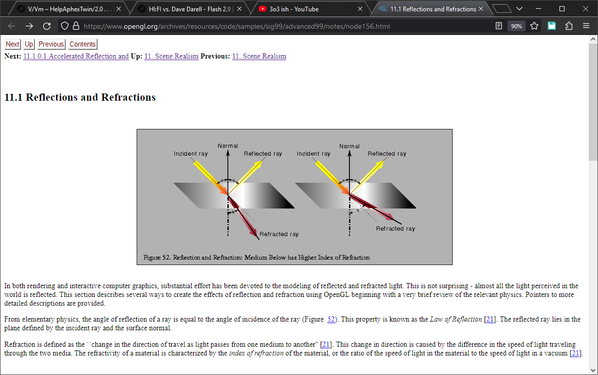

# firefox-chrome
userchrome.css for firefox which makes tab panel look like in old chrome versions

works well for firefox v120 with default dark theme

slightly modified and updated for new browser version, was found [here](https://gitlab.com/brudolp/userChrome/-/tree/master/google-chrome-style)

